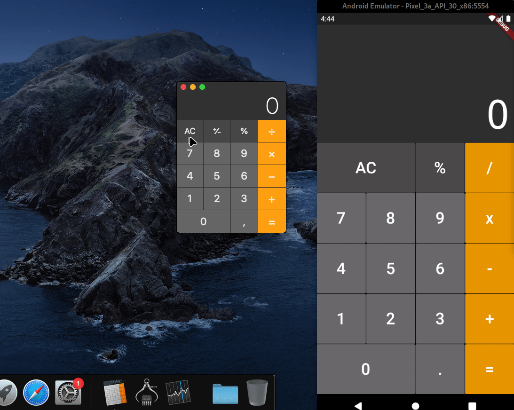

# flutter-calculator

Calculator developed in Flutter based on the macOS 10.15 Catalina calculator design.

A second display above has been added to show the buffer with the operations being performed.

The demonstration can be seen below:

## Demonstration

